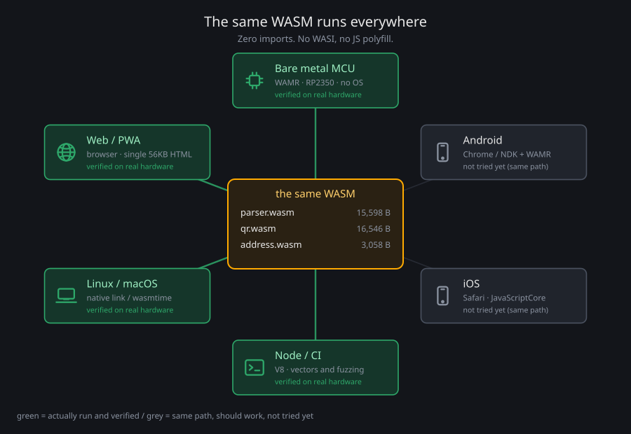

# baremetal-wasm-signer

[](https://github.com/habakan/baremetal-wasm-signer/actions/workflows/ci.yml)

英語版は [README.md](README.md)。

**署名器の中身を、UI から切り離した部品にした。**
取引を読み解く部分（PSBT・UR の解析）と鍵を扱う部分を、それぞれ import を 1 個も持たない WASM にしてある。
だから、どんな言語・どんな画面の裏にでも置ける。



OS の無いマイコン（RP2350）と iPhone の Safari で、**同じ 15,570 byte** が動く。
`parser.wasm` はバイト単位で同じものが載り、その SHA-256 をデバイスも画面に出すので、
手元で `make check-repro` した結果と突き合わせられる。

| | |
|---|---|
| コンセプト（図つき） | [docs/everywhere.md](docs/everywhere.md) |
| 何を作っていて誰のどんな問題を解くのか | [docs/positioning.md](docs/positioning.md) |
| 他の言語から呼ぶための仕様 | [components/parts/parser/docs/abi.md](components/parts/parser/docs/abi.md)（英語） |

## 注意

**第三者のレビューを受けていない。本番の資金に使わないこと。**

signet で一巡していて、このページの主張はすべてこのリポジトリ内の実測に基づく。
ただしそれは、作者以外から攻撃されたことがある、ということではない。
mainnet の前提は [docs/architecture-b.md](docs/architecture-b.md) §15、
受理する範囲と「やらないこと」は [docs/limitations.md](docs/limitations.md)（英語）。

セキュリティ上の問題は [SECURITY.md](SECURITY.md) へ。**公開の issue には書かないこと。**

## 何ができるか

カメラから SeedQR で鍵を読み、アニメーション QR（UR）で PSBT を受け取り、確認画面を経て署名し、
署名済み PSBT を QR で返す。PC 側には鍵も復元句も一度も置かない運用で、
[signet の取引](https://mempool.space/signet/tx/de849e8c01a39fcf2aa84aaeeccb2ac8aea128086b2f4252539bcab90a0a432f)
を通した（手順は [docs/signet.md](docs/signet.md)）。

| 段 | 実測 | |
|---|---|---|
| BIP39 シード（PBKDF2 2048 回） | 0.47 s | ネイティブ |
| PSBT 解析 | 25 ms | **parser.wasm**（WAMR classic interp） |
| 検査・確認画面の組み立て | 147 ms | ネイティブ |
| 署名（2 入力、ECDSA + Schnorr） | 126 ms | ネイティブ。embit で独立検証 |
| アニメーション QR 出力 | 1 パート 95 ms | `@ngraveio/bc-ur` で復元・バイト一致 |
| RAM | 約 341KB / 520KB | quirc と PSBT バッファはヒープを共有 |

実際に動かして確かめた環境: ベアメタル MCU（RP2350）、ブラウザ、Android 10、iOS、Linux / macOS、Node。

未対応: マルチシグ、パスフレーズ、PSBT v2。単署名の P2WPKH / P2TR だけ。

## 試す

### 基板が無くても

```sh
git submodule update --init
make deps          # third_party を取得してパッチを当てる
make viewer        # build/viewer.html を作ってブラウザで開く
```

189KB の HTML 1 枚に 3 つの WASM（解析・QR・アドレス）が入っている。オフラインで動き、
`file://` のままカメラも使える（Android は localhost か HTTPS が要る）。

### 他の言語から

`components/parts/parser/hosts/` に Kotlin（Chicory）と Swift（WasmKit）の例がある。
どちらも JNI もネイティブのビルドも要らない。**C・JS・Kotlin・Swift・実機の 5 つが同じ答えを返す。**

### 実機

部品と配線は [docs/hardware.md](docs/hardware.md)、実配線は [docs/breadboard.md](docs/breadboard.md)。

```sh
make deps-openocd                 # 一度だけ。SWD 書き込み用（Raspberry Pi のフォーク）
make run SECONDS=180              # 書き込み → 受信開始 → リセット
make run TESTNET=1 SECONDS=180    # signet 用
```

`TEST_SEED=1` でビルドしたものだけ BIP39 のテストベクタを選べる（既定は 0）。資金を扱ってはならない。
本番で使うときの手順は [docs/architecture-b.md](docs/architecture-b.md) の「本番で使うときの手順」。

## 自分で確かめる

```sh
make check-repro   # 版を固定したツールチェーンで parser.wasm を作り直し、記録と突き合わせる
```

デバイスの `Parser hash` 画面、ビューアのページ下部、この出力の 3 つが一致すれば、
**デバイスの中で動いている解析器は公開ソースから出たもの**だと言える
（[docs/reproducible-build.md](docs/reproducible-build.md)）。

```sh
make check-core        # 中核のベクタ（71 項目）
make check-xpub        # 口座 xpub とディスクリプタ（BIP84 の公式ベクタ）
make check-psbt        # PSBT 一巡 + UR の往復 + 署名を embit で独立検証
make check-ui          # 画面の組み立て
make check-seedqr      # SeedQR の読み取り（ASan 付き）
make check-host        # Mac: ネイティブ / WAMR classic / fast
make check-qemu-psbt   # RV32 で PSBT 一巡（ホストの出力と一致するか）
make check-qemu-qr     # quirc の命令数
make check-qr-mac      # quirc と zxing-cpp の読取可否を比べる
make check-camera-sim  # camera.pio を Python のシミュレータで検証
make -C components/parts/parser test        # 解析器のベクタ（529 項目）
make -C components/parts/parser check-fuzz  # 解析器へのファジング
```

期待値は独立に作る（embit / hashlib / `@ngraveio/bc-ur` / zxing-cpp / Bitcoin Core）。
テストを足したらミューテーションテストで検出力を確かめる。

## リポジトリの歩き方

**部品が主で、実機とビューアはその用例**という関係になっている。

| | | TCB |
|---|---|---|
| `components/parts/parser/` | PSBT・UR の解析（submodule [wasm-bitcoin-signer](https://github.com/habakan/wasm-bitcoin-signer)）。`parser.wasm` になる。ABI 仕様・ホスト実装例・ファジングもここ | **外** |
| `components/qr/` | QR デコーダ（submodule [quirc](https://github.com/habakan/quirc) の `mcu` ブランチ。FPU 無し向けに固定小数点化） | 外 |
| `components/parts/signer/` | 鍵と署名。BIP32 導出、BIP143/BIP341 sighash、アドレス、plan の検査、SeedQR。実機にはネイティブ、ブラウザには wasm で載る | 内 |
| `apps/device/rp2350/` | 実機のファーム。液晶（ST7789）、ボタン、カメラ（PIO + DMA） | 内 |
| `apps/device/ui/` | 240x240 の画面を組む。表示先に依存しない | 内 |
| `apps/device/runtime/` | parser.wasm の呼び出し口（線形メモリとの出入りを範囲検証する境界）と WAMR のプラットフォーム層 | 内 |
| `apps/viewer/` | 実機と同じ wasm で PSBT を表示する単一 HTML | - |
| `apps/host/` | Mac / QEMU で動かす検査用のホスト | - |
| `tools/` `docs/` | ベクタ生成・参照実装との照合・配線図などのスクリプトと、設計・実測の記録 | - |

依存（`third_party/`、gitignore 済み）は `make deps` で clone する:
libsecp256k1、WAMR 2.4.3、pico-sdk 2.3.1、QR-Code-generator、spleen フォント、RISC-V ツールチェーン。

### 実機のファームの種類

| ターゲット | 用途 |
|---|---|
| `app` | 本体。PSBT 署名の一巡、xpub 表示、解析器ハッシュ表示 |
| `app_nolcd` | 同じ内容を UART に文字で出す（液晶なしでの回帰） |
| `psbt_bench` `qr_bench` `signer` | 時間・メモリの計測 |
| `camera_test` `pio_loopback_test` `button_test` | 配線とカメラの切り分け |

## 設計と実測の記録

| 文書 | 内容 |
|---|---|
| [docs/architecture.md](docs/architecture.md) | システム構成（信頼境界・一巡・メモリ）。図つき |
| [docs/design.md](docs/design.md) | 設計と、何を信頼しないかの線引き |
| [docs/architecture-b.md](docs/architecture-b.md) | 解析器を WASM に隔離する構成、plan の形式、残作業 |
| [docs/reproducible-build.md](docs/reproducible-build.md) | 再現可能ビルドと、`wasm-opt` が PATH にあるだけで成果物が変わる罠 |
| [docs/signet.md](docs/signet.md) | bitcoin-cli でのウォッチオンリー運用と一巡 |
| [docs/feasibility.md](docs/feasibility.md) | RP2350 に載るか（サイズ・速度）、実機 4 構成の比較 |
| [docs/kdf-feasibility.md](docs/kdf-feasibility.md) | BIP39 / BIP32 の速度と、SHA-512 を import に出す判断 |
| [docs/aot-feasibility.md](docs/aot-feasibility.md) | WAMR AOT。XIP は実機で 7 倍遅い |
| [docs/qr-feasibility.md](docs/qr-feasibility.md) | QR の読み書き、quirc の固定小数点化、RAM 見積り |
| [docs/hardware.md](docs/hardware.md) [docs/breadboard.md](docs/breadboard.md) | 配線。`make wiring` `make breadboard` で図を作る |

失敗もそのまま残してある。AOT の XIP が 7 倍遅いこと、WAMR の非整列 `i64.store`、
`wasm-opt` が PATH にあるだけで成果物が 2.7KB 変わること、quirc が液晶の遠景を読めないこと。

## 上流への還元

- **WAMR**: classic interpreter の `i64.store` が 4 byte 境界を前提にしていたバグを修正
  （[PR #5123](https://github.com/wasm-micro-runtime/wasm-micro-runtime/pull/5123)、2026-09-30 マージ）。
  非整列アクセスを許さない CPU で踏む。QEMU では再現しない
- **quirc**: 自前フォーク（`mcu` ブランチ）で固定小数点化、未マージのセキュリティ修正の取り込み、
  UBSan とファジング

## ライセンス

MIT（[LICENSE](LICENSE)）。取り込んでいる第三者のコードは [NOTICE](NOTICE) を見る。
