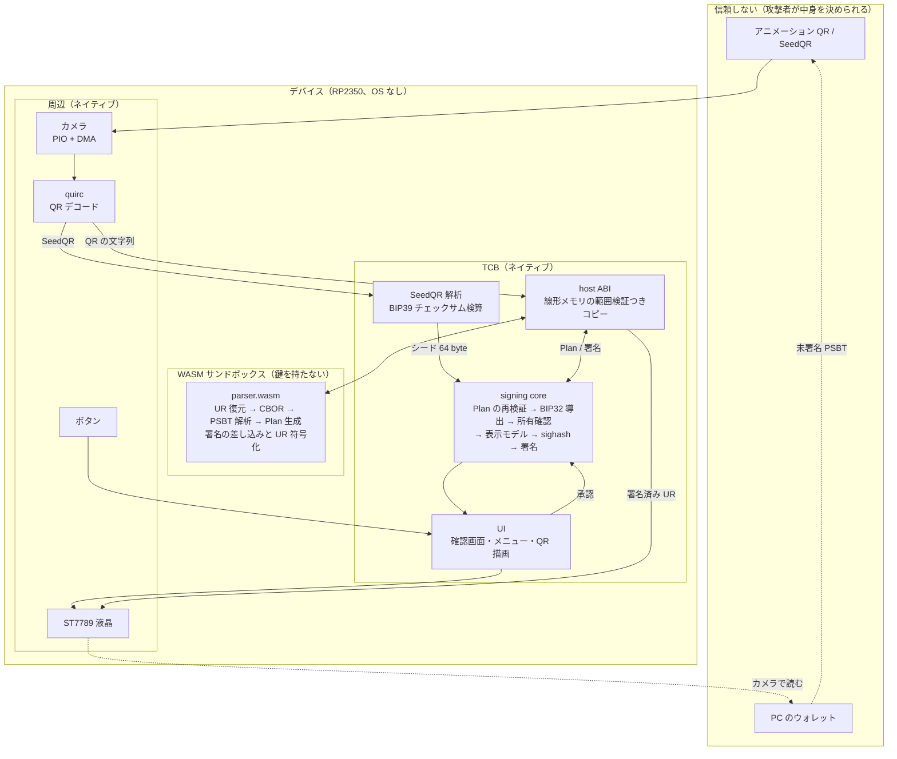
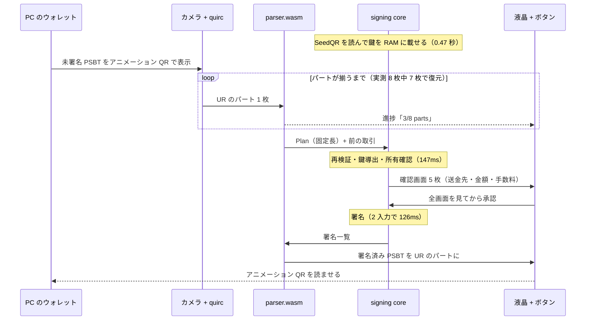
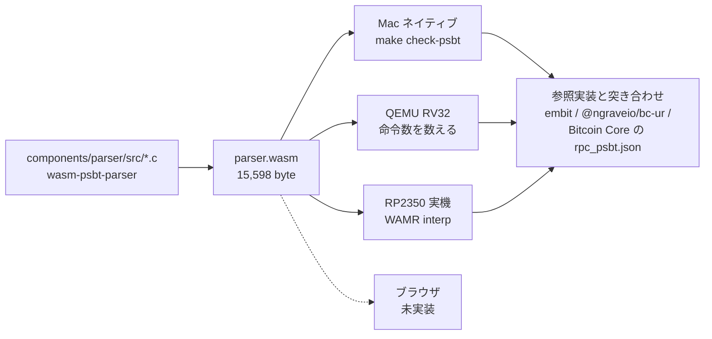
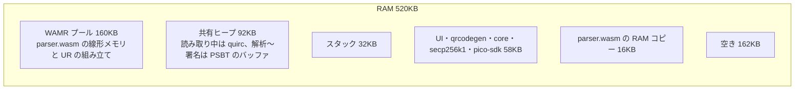

# システム構成

実機で動いているものの全体像（2026-10-03）。設計の背景は [design.md](design.md)、
解析器を分離する判断は [architecture-b.md](architecture-b.md)。

## 1. 信頼境界

攻撃者が中身を決められるデータ（QR、PSBT）は、**鍵を持たない WASM の中でしか触らない**。
鍵と署名はネイティブ側に置き、両者の往復は固定長のレコード 1 枚に絞る。

境界で守っていること:

- `parser.wasm` は **import を 1 個も持たない**。時計もメモリ確保もネットワークも触れない
- ホストは `parser.wasm` が返したアドレスと長さを `wasm_runtime_validate_app_addr` で検証してからコピーする
- 受け渡しは固定長 5,016 byte の `plan_t` 1 枚。`_Static_assert` でレイアウトを固定している
- **ネイティブ側が Plan を再検証する。** 解析器が嘘をついても、鍵の導出と所有確認はネイティブ側で独立に行う
- 画面に出した内容と署名対象が一致することは、`core_sign` が `core_review` 済みの Plan の SHA-256 一致を要求することで担保する

## 2. 署名の一巡

## 3. 同じ `.wasm` をどこでも検証できる

解析器はバイト単位で同じものが 4 か所で動く。実機でしか再現しない不具合を切り分けられるのと、
第三者が同じ成果物を独立に検証できるのが利点。

## 4. メモリ（520KB をどう使うか）

- **quirc（90KB）と PSBT のバッファ（66KB）は同じヒープを順に使う。** 読み取りが終われば quirc は要らず、
  解析より前に PSBT のバッファは要らない。実機で山が 93,696 B のままなのを確認した（共有しなければ 159,232 B）
- `parser.wasm` を AOT にすると速いが、RAM 展開が必須（XIP は実機で 7 倍遅い）でプールが 277KB になり、
  カメラと両立できない。案 B では解析器が軽いので、一巡は 8% しか変わらない。**インタプリタのままにする**

## 5. 実測（Pico 2 H、150MHz）

| 段 | 実行場所 | 時間 |
|---|---|---|
| SeedQR → シード（PBKDF2 2048 回） | ネイティブ | 0.47 秒 |
| QR 1 フレームの取り込み | PIO + DMA | 120ms |
| QR のデコード | quirc | 62ms（見つかると 300ms） |
| PSBT 解析 | **parser.wasm** | 25ms |
| 検査・表示の組み立て | ネイティブ | 147ms |
| 署名（2 入力、ECDSA + Schnorr） | ネイティブ | 126ms |
| 署名の差し込み | **parser.wasm** | 0.8ms |
| UR 符号化 + QR 生成 | wasm + ネイティブ | 1 パート 95ms |
