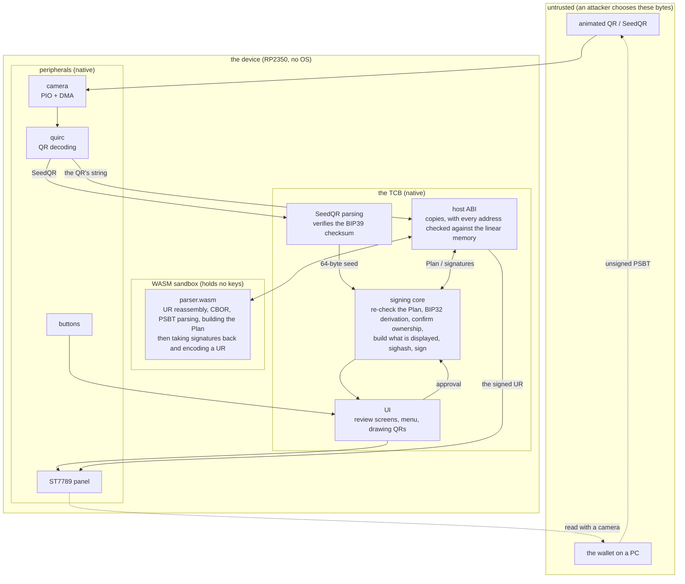
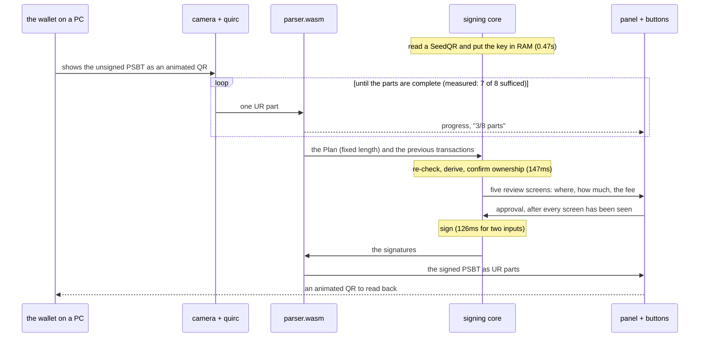
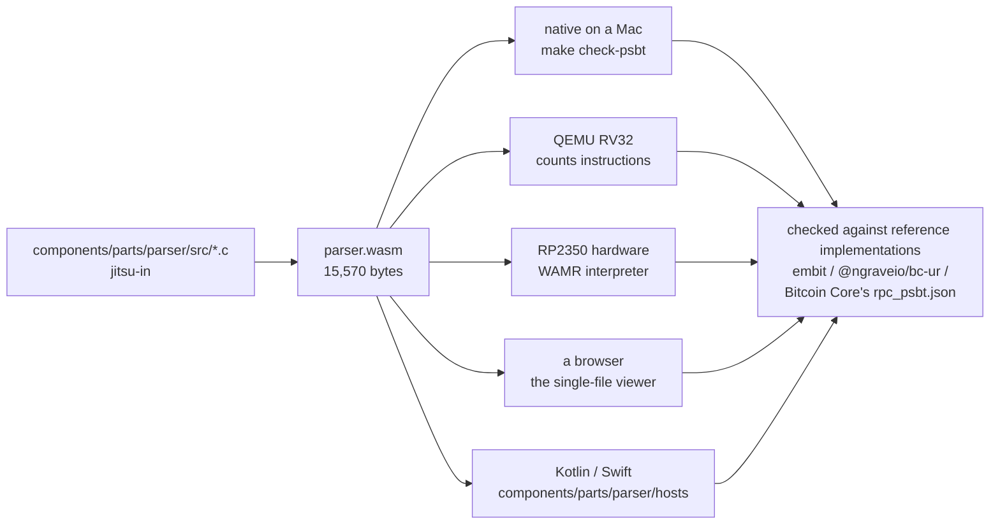
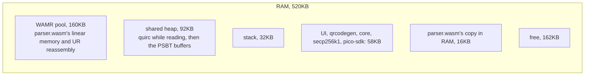

# How the system is put together

The current device architecture. Detailed checks and the reason for the parser boundary are in
[signing-architecture.md](signing-architecture.md).

## 1. The trust boundary

UR and PSBT data are parsed inside a WASM module that holds no keys. Camera frames are decoded by
native quirc, which remains in the trusted computing base. The keys and signing stay native, and the
parser and signer communicate through a fixed-length record.

What the boundary is actually enforcing:

- `parser.wasm` has **no imports at all**. No clock, no allocation, no network
- The host checks every address and length `parser.wasm` returns with
  `wasm_runtime_validate_app_addr` before copying anything
- What crosses is one fixed 5,016-byte `plan_t`, with its layout nailed down by `_Static_assert`
- **The native side re-checks the Plan.** If the parser lies, key derivation and the ownership check
  happen independently on the native side anyway
- That what was shown is what gets signed is enforced by `core_sign` requiring the SHA-256 of the Plan
  to match the one `core_review` was given

## 2. One signing round

## 3. The same `.wasm`, verifiable anywhere

The parser runs as the identical bytes in six places. That isolates bugs that only reproduce on the
hardware, and it lets someone else verify the same artifact independently.

## 4. Memory: what the 520KB goes on

- **quirc (90KB) and the PSBT buffers (66KB) use the same heap one after the other.** Once reading is
  done quirc is not needed, and before parsing the PSBT buffers are not needed. Measured on the
  hardware, the peak stays at 93,696 B; without sharing it would be 159,232 B
- AOT makes `parser.wasm` faster but has to be expanded into RAM — executing in place measured seven
  times slower — which pushes the pool to 277KB and no longer leaves room for the camera. With the
  parser this light, a full round only changes by 8%, so **the interpreter stays**

## 5. Measured (Pico 2 H, 150MHz)

| step | where it runs | time |
|---|---|---|
| SeedQR to seed (PBKDF2, 2048 rounds) | native | 0.47s |
| capturing one QR frame | PIO + DMA | 120ms |
| decoding the QR | quirc | 62ms, or 300ms when it finds one |
| parsing the PSBT | **parser.wasm** | 25ms |
| checking it and building the display | native | 147ms |
| signing (two inputs, ECDSA + Schnorr) | native | 126ms |
| taking the signatures back | **parser.wasm** | 0.8ms |
| UR encoding and building the QR | wasm + native | 95ms per part |
