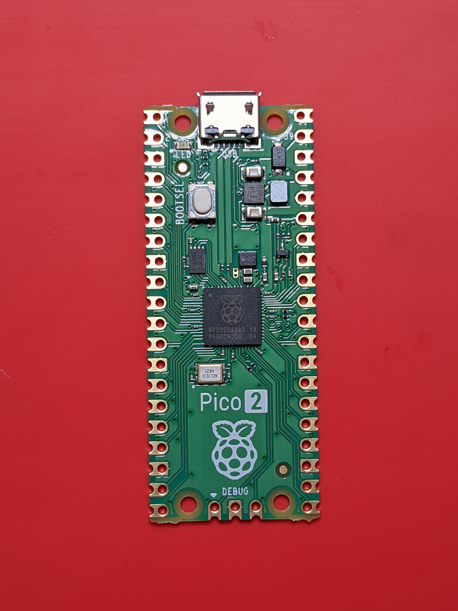
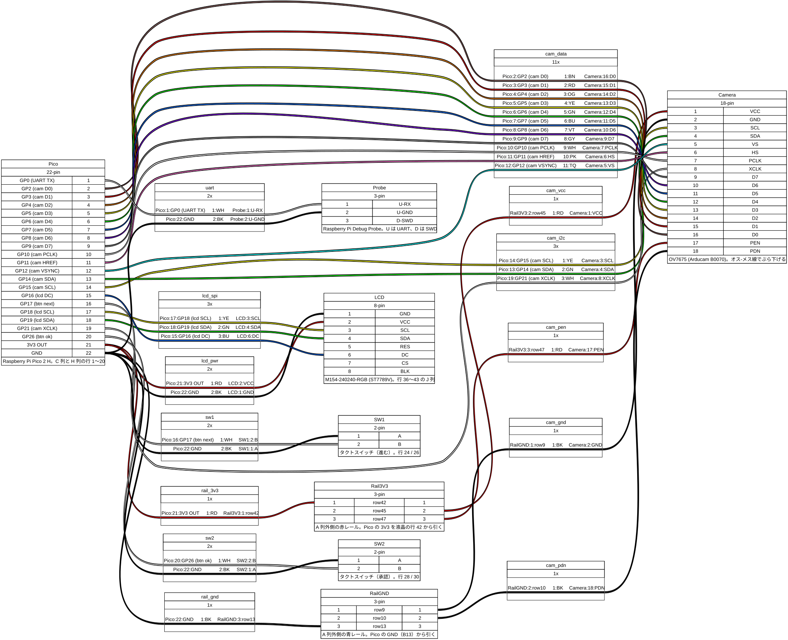
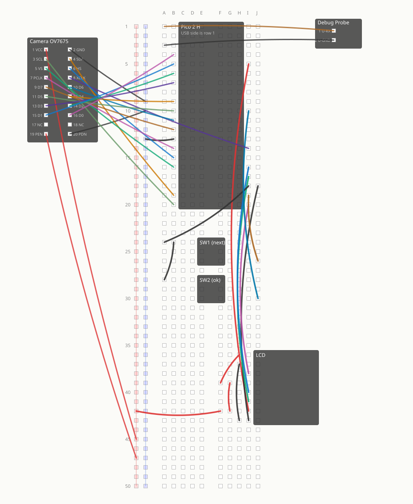

# Breadboard Wiring

[日本語](ja/breadboard.md)

Photo: [Profpcde / Wikimedia Commons](https://commons.wikimedia.org/wiki/File:Top_view_of_a_Raspberry_Pi_Pico_2_microcontroller_board.jpg), CC0 1.0. Raspberry Pi is a trademark of Raspberry Pi Ltd. This project is not endorsed by Raspberry Pi Ltd. The build uses a Pico 2 H.

This documents the wiring as built. Update this page when the wiring changes. The logical pin assignments are in [hardware.md](hardware.md); the firmware definitions are in [src/board_pins.h](../src/board_pins.h).

The wiring is also defined in machine-readable files.

| File | Contents | Generate with |
|---|---|---|
| [breadboard.yml](breadboard.yml) | Hole-to-hole connections | `make breadboard` generates the breadboard layout (SVG) |
| [wiring.yml](wiring.yml) | Signal connections (WireViz) | `make wiring` generates the wiring diagram, bill of materials, and HTML |

Update this page and both YAML files when the wiring changes.

## Diagrams

### Signal connections

### Physical layout

## Setup

- Breadboard: EIC-102J. Insert the Pico 2 H across columns **C and H**, rows **1–20** (row 1 is at the USB end).
- The Pico board covers columns D–G, so in rows 1–20 only columns **A and B** (left of C) and **I and J** (right of H) are accessible.
- Use one wire per hole. Use another hole in the same row if needed; holes in a row are electrically connected.

## Row and pin mapping

| Row | Column C (physical pin = row number) | Column H (physical pin = 41 - row number) |
|---|---|---|
| 1 | GP0 (UART TX → Debug Probe) | VBUS |
| 2 | GP1 | VSYS |
| 3 | GND | GND |
| 4 | GP2 (camera D0) | 3V3_EN |
| 5 | GP3 (camera D1) | **3V3 OUT** |
| 6 | GP4 (camera D2) | ADC_VREF |
| 7 | GP5 (camera D3) | GP28 |
| 8 | GND | AGND |
| 9 | GP6 (camera D4) | GP27 |
| 10 | GP7 (camera D5) | GP26 (confirm) |
| 11 | GP8 (camera D6) | RUN |
| 12 | GP9 (camera D7) | GP22 |
| 13 | GND | GND |
| 14 | GP10 (camera PCLK) | GP21 (camera XCLK) |
| 15 | GP11 (camera HREF) | GP20 |
| 16 | GP12 (camera VSYNC) | GP19 (LCD SDA) |
| 17 | GP13 | GP18 (LCD SCL) |
| 18 | GND | GND |
| 19 | GP14 (camera SDA) | GP17 (next button) |
| 20 | GP15 (camera SCL) | GP16 (LCD DC) |

## Debug Probe (including connections off the breadboard)

| From | To | Notes |
|---|---|---|
| D port (SWD) | Pico 2 H debug connector (3-pin connector at board edge) | Included SH-SH cable; used for flashing |
| U port RX | **A1** (GP0 = UART TX) | Receives logs; do not use TX |
| U port GND | **A3** or **B3** (GND) | |
| Debug Probe USB | PC | |
| Pico USB | PC (power) | Separate cable |

## Power rails

| From | To | Notes |
|---|---|---|
| F42 (free hole on the same row as the LCD 3V3 connection) | Red rail outside column **A**, around row 42 | 3V3 |
| B13 | Blue rail outside column **A**, around row 13 | GND (directly connected to Pico) |

Rail holes are grouped in sets of five and do not map one-to-one to breadboard row numbers. Holes in the same half of a rail are electrically connected. Many boards split the rails at the center, so 3V3 uses the rear half (feed at 42, takeoffs at 45 and 47) and GND uses the front half (feed at 13, takeoffs at 9 and 10).

There are two sets of rails, outside columns A and J. **Use the A-side rails.** The LCD covers rows 36–43 on the J side, making those holes hard to reach. The camera's SCL and SDA connections (B19 and B20) are also on the A–E side. On boards with rails split at the center, the two halves are separate.

Pico 3V3 OUT (physical pin 36 = H5) is already occupied at row 5, so tee off the 3V3 line going to the LCD.

## LCD M154-240240-RGB (rows 36–43, column J; the display overhangs the board)

| Row | LCD pin | Wiring |
|---|---|---|
| 36 | BLK | 3V3 (jumper from row 39) |
| 37 | CS | GND (jumper from row 43) |
| 38 | DC | I38 → I20 (GP16) |
| 39 | RES | 3V3 (jumper from row 42) |
| 40 | SDA | I40 → I16 (GP19) |
| 41 | SCL | I41 → I17 (GP18) |
| 42 | VCC | I42 → I5 (3V3 OUT) |
| 43 | GND | I43 → J18 (GND) |

Chain 3V3 from row 42 to 39 to 36, and GND from row 43 to 37. Use any free hole in the same row.

## Buttons (tactile switches across the center gap)

The switch legs go into rows n and n+2. Pressing a switch connects those two rows.

| Switch | Rows | GND side | Signal side | Action |
|---|---|---|---|---|
| SW1 | 24 / 26 | A24 → I18 (GND) | J26 → I19 (GP17) | Next |
| SW2 | 28 / 30 | B24 → A28 (GND jumper) | J30 → I10 (GP26) | Confirm |

If a joystick is added, it also uses UP=GP13 (C17), LEFT=GP20 (H15), and RIGHT=GP22 (H12).

## OV7675 camera (Arducam B0070, 2×10, 20 pins)

Pin order follows the silkscreen on the board: odd-numbered pins are on the left, even-numbered pins on the right.

| Pin | Name | Connect to | Stage |
|---|---|---|---|
| 1 | VCC | Red rail 45 | 1 |
| 2 | GND | Blue rail 9 | 1 |
| 3 | SCL | B20 (GP15) | 1 |
| 4 | SDA | B19 (GP14) | 1 |
| 5 | VS | B16 (GP12) | 2 |
| 6 | HS | B15 (GP11) | 2 |
| 7 | PCLK | B14 (GP10) | 2 |
| 8 | XCLK | I14 (GP21) | 1 |
| 9 | D7 | B12 (GP9) | 2 |
| 10 | D6 | B11 (GP8) | 2 |
| 11 | D5 | B10 (GP7) | 2 |
| 12 | D4 | B9 (GP6) | 2 |
| 13 | D3 | B7 (GP5) | 2 |
| 14 | D2 | B6 (GP4) | 2 |
| 15 | D1 | B5 (GP3) | 2 |
| 16 | D0 | B4 (GP2) | 2 |
| 17 | NC | - | - |
| 18 | NC | - | - |
| 19 | PEN | Red rail 47 (enables the board's power) | 1 |
| 20 | PDN | Blue rail 10 (releases power-down) | 1 |

The 2-row header cannot plug directly into the breadboard because it cannot straddle the center gap. Use male-to-female jumper wires.

For **stage 1** (7 wires), run `make run ELF=build/rp2350/camera_test.elf`. A `PID 0x76` result confirms power, I2C, and XCLK. Add the 11 stage 2 wires only after this passes.

At startup, `camera_test` reports GP2–GP17 states and edge counts for PCLK, HREF, and VSYNC. **The edge counts help identify which signals are connected** (in 100 ms: about 100,000 PCLK edges, 1,300 HREF edges, and 2 VSYNC edges). This helps find wiring mistakes. The left column (VCC, SCL, VS, PCLK, D7, …) and right column (GND, SDA, HS, XCLK, D6, …) are easy to swap.

## Wire count

| Group | Count | Status |
|---|---:|---|
| Debug Probe (2 UART wires + SWD cable + 2 USB cables) | 2 + 3 | Done |
| Power rails (3V3, GND) | 2 | Done |
| LCD | 8 | Done |
| Two buttons | 4 | Done |
| Camera stage 1 | 7 | Done (PID 0x76 / VER 0x73 confirmed) |
| Camera stage 2 | 11 | Done (capture succeeds) |
| **Total (complete build)** | **34** | |

Adding a joystick takes 8 connections (+V, two GND, SW, A, B, C, D) and replaces the four wires for the two tactile switches.
