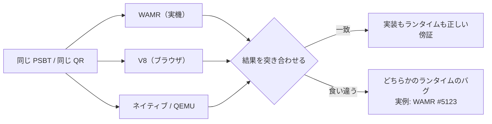
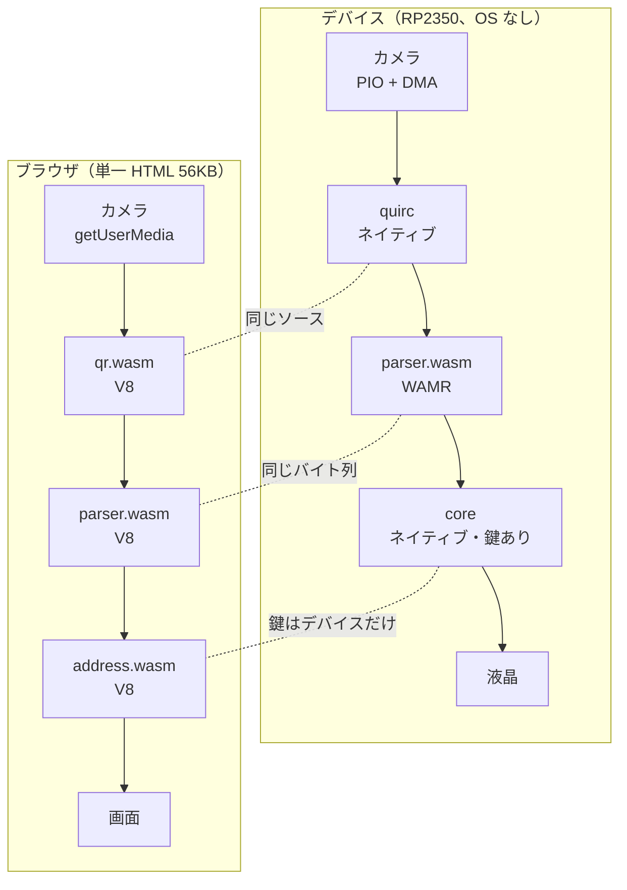
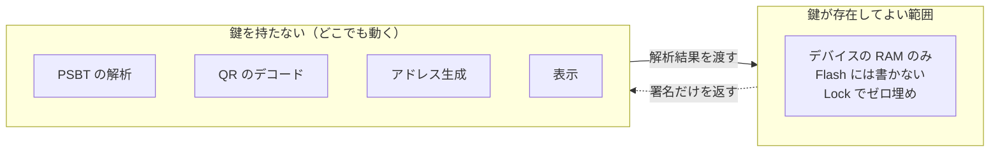

# 同じコードがどこでも動く

このプロジェクトのコンセプト。技術的な中身は [architecture.md](architecture.md)、
位置づけと公開の方針は [positioning.md](positioning.md)。

## 一文で

**取引を読み解く部分を鍵から切り離し、同じバイナリをデバイスでもブラウザでも動かせるようにした。**
だから、署名するときに画面へ出る内容を、誰でも自分の手元で再現して確かめられる。

## 何が「同じ」なのか

3 つの WASM に切り出してある。どれも **import を 1 個も持たない**ので、
WASI も JS のポリフィルも要らず、置かれた場所の違いが結果に影響しない。

| | 大きさ | import | 役割 |
|---|---:|---:|---|
| `parser.wasm` | 15,570 B | 0 | UR の復元、PSBT の解析、Plan 生成、署名の差し込み、UR 符号化 |
| `qr.wasm`（quirc） | 16,546 B | 0 | QR のデコード（FPU 無し向けに固定小数点化した自前フォーク） |
| `address.wasm` | 3,058 B | 0 | scriptPubKey → アドレス（bech32 / bech32m / base58check） |

`parser.wasm` は**バイト単位で同じもの**がデバイスに載る。`qr.wasm` と `address.wasm` は
デバイスではネイティブに積むので、同じソースから別のターゲットへ出したものになる。

**QR のデコーダだけは、読めなければ別の実装に落ちる。** ブラウザでは quirc を先に試し、
駄目ならブラウザ内蔵（`BarcodeDetector`）、それも無ければ同梱の jsQR を使う。
これで主張が崩れないのは、**デコーダが信頼の起点ではない**から。出てきた文字列は必ず
`parser.wasm` が解析し、壊れていれば弾かれる。どのデコーダで読めたかは画面に出すので、
quirc が苦手な条件はそのまま観測できる（→ [内部メモ](internal/qr-decoder.md)）。

## 同じバイト列を、どこでも動かす

WASM に揃えてあるので、載せる先は「WASM を実行できる何か」でよい。
OS の有無も、CPU が ARM か RISC-V か x86 かも、言語が C か JavaScript かも関係なくなる。


図は `make everywhere`（`tools/draw_everywhere.py`）で作る。

緑が実際に動かして確認したもの、灰色は同じ経路なので動くはずだが未確認のもの。

| 置く先 | ランタイム | 状態 |
|---|---|---|
| ベアメタル MCU（RP2350） | WAMR classic interp | **確認済み。** signet の取引に署名してブロックに入った |
| Web / PWA（単一 HTML） | ブラウザの WASM エンジン | **確認済み。** 同じ PSBT から同じ出力・同じアドレス |
| Node（CI・検査） | V8 | **確認済み。** `parser.wasm` を import 0 のまま読み、実機と同じ解析結果 |
| Linux / macOS のツール | ネイティブ直リンク / wasmtime | **確認済み**（ネイティブ直リンクで `make check-psbt`） |
| Android | Chrome（V8） | **確認済み**（A80 / Android 10）。`file://` で単一 HTML が動き、ハッシュ 3 つも一致。
ただし `file://` ではカメラが `NotAllowedError` になるので、読み取りは localhost か HTTPS が要る。
読み取れた QR はブラウザ内蔵のデコーダ経由で、quirc は離れて撮った液晶には届かない |
| iOS | Safari（JavaScriptCore） | **確認済み**。3 つの wasm が動きハッシュも一致。ただしローカルファイルを開けないので
配るには一度オンラインで読み込む必要があり、カメラには HTTPS が要る |

**同じ成果物のまま、載せる先だけを変えられる**のが要点になる。
ベアメタルの MCU とブラウザという、普通は共通化できない両端で同じバイト列が動いている。

## ランタイムが違うことが利点になる



同じ入力に対して結果が食い違えば、解析器ではなくランタイム側の問題だと切り分けられる。
実際に見つけた
[WAMR の非整列 `i64.store`](https://github.com/wasm-micro-runtime/wasm-micro-runtime/pull/5123) は
まさにこの種類で、QEMU では再現せず実機だけで落ちた。ブラウザという第 3 のランタイムがあれば、
この手の差異を早く捕まえられる。

## 実機とブラウザの対応



同じ PSBT をどちらに食わせても、同じ出力・同じアドレス・同じ手数料が出る。
実際に確かめた値:

```
out 1  0.00100000  bc1q5knnnmmfe7xqdr55g43jyec388dtsah27rxamf
out 2  0.00020000  bc1qnpzzqjzet8gd5gl8l6gzhuc4s9xv0djt0rlu7a
out 3  0.00049000  bc1p3qkhfews2uk44qtvauqyr2ttdsw7svhkl9nkm9s9c3x4ax5h60wqwruhk7
fee    0.00001000 BTC
```

## 鍵は動かさない

「どこでも動く」のは**鍵を持たない部分だけ**。ここを混ぜると安全性の説明が崩れる。



例外として、ブラウザ版には**回復モード**を置く（デバイスが壊れたときの最後の手段）。
既定では鍵の入力欄すら出さず、明示的に切り替えたときだけ有効にする。
詳しくは [positioning.md](positioning.md) の「PWA に鍵と署名も載せるか」。

## 何が嬉しいか

1. **デバイスの表示を手元で再現できる。** 同じ PSBT をブラウザに食わせて、画面と見比べられる
2. **ランタイム間の差分テストになる。** 食い違えばランタイムのバグだと分かる
3. **解析器だけを独立に監査できる。** 15.6KB の WASM 1 個。ファジングも再現可能ビルドも現実的
4. **オフラインで配れる。** 56KB の単一 HTML。通信も Service Worker も要らず、USB で渡せる
5. **ハードが無くても検証できる。** 基板を買わずに、解析と表示のロジックを確かめられる

## できていること・いないこと

| | 状態 |
|---|---|
| 実機で一巡（SeedQR → UR 読取 → 確認 → 署名 → UR 出力） | 済。signet の取引がブロックに入った |
| 単一 HTML で PSBT を解析・表示 | 済（`make viewer`） |
| 単一 HTML でカメラから実機の QR を読む | 済。ただし離れて撮ると quirc は読めず、jsQR か内蔵デコーダに落ちる |
| デバイスから xpub / 出力ディスクリプタを QR で出す | 済。PC 側をウォッチオンリーにできる |
| PC に鍵を置かない一巡 | 済。[signet の取引](https://mempool.space/signet/tx/de849e8c01a39fcf2aa84aaeeccb2ac8aea128086b2f4252539bcab90a0a432f)（[手順](signet.md)） |
| デバイスが自分の `parser.wasm` のハッシュを表示 | 未。これが入るとハッシュの突き合わせが閉じる |
| 自分の鍵かどうかの判定（ブラウザ側） | 未。xpub の入力欄が要る |
| 回復モード（`bitcoin-signer.wasm` を載せる） | 未。wasm 自体は動作確認済み |
| 再現可能ビルド（第三者が同じハッシュを出せる） | 未。公開前の必須項目 |

## 作り方

```
make viewer     # build/viewer.html（単一ファイル）を作ってブラウザで開く
```

`file://` で開いても動く。手元の Mac では `file://` のままカメラも使えた。

カメラが使えるかは**ページの出所**で決まる。安全なコンテキストでないと、ブラウザは
`navigator.mediaDevices` ごと消す（`TypeError` になる）。

| 出所 | カメラ |
|---|---|
| `https://` / `http://localhost` | 使える |
| `file://`（Mac の Safari・Chrome） | 使える |
| `file://`（Android の Chrome） | 拒否（`NotAllowedError`） |
| `http://192.168.x.x`（LAN） | API ごと無い（`TypeError`） |

開発中に Android のカメラを試すときは `adb reverse tcp:8000 tcp:8000` で localhost にすると通る。
通信は USB ケーブルの中だけで、ネットワークには出ない。
