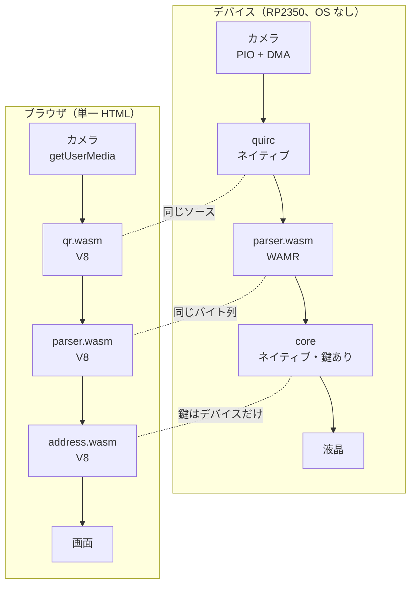
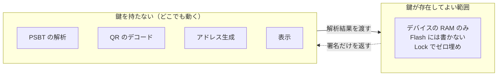

# デバイスとブラウザの対応

**「同じバイト列がどこでも動く」という主張そのものと、置き先の一覧は
[components/parts/docs/everywhere.md](../components/parts/docs/everywhere.md) にある。**
モジュールの話なので submodule 側が正本。ここには**このデバイス固有の話**だけを置く。

技術的な中身は [architecture.md](architecture.md)、位置づけは [positioning.md](positioning.md)。

## 実行環境ごとの違い



`parser.wasm` だけが**バイト単位で同じもの**。`qr.wasm` と `address.wasm` は
デバイスではネイティブに積むので、同じソースから別のターゲットへ出したものになる。
署名器はデバイスではネイティブ C で、`signer.wasm` を解釈しているわけではない。

同じ PSBT をどちらに食わせても、同じ出力・同じアドレス・同じ手数料が出る。確かめた値:

```
out 1  0.00100000  bc1q5knnnmmfe7xqdr55g43jyec388dtsah27rxamf
out 2  0.00020000  bc1qnpzzqjzet8gd5gl8l6gzhuc4s9xv0djt0rlu7a
out 3  0.00049000  bc1p3qkhfews2uk44qtvauqyr2ttdsw7svhkl9nkm9s9c3x4ax5h60wqwruhk7
fee    0.00001000 BTC
```

## QR のデコーダだけは落ちる先がある

ブラウザでは quirc を先に試し、駄目ならブラウザ内蔵（`BarcodeDetector`）、
それも無ければ同梱の jsQR を使う。これで主張が崩れないのは、**デコーダが信頼の起点ではない**から。
出てきた文字列は必ず `parser.wasm` が解析し、壊れていれば弾かれる。
どのデコーダで読めたかは画面に出すので、quirc が苦手な条件はそのまま観測できる。

## 鍵は動かさない

「どこでも動く」のは**鍵を持たない部分だけ**。ここを混ぜると安全性の説明が崩れる。



例外として、ブラウザ版には**回復モード**を置く（デバイスが壊れたときの最後の手段）。
既定では鍵の入力欄すら出さず、明示的に切り替えたときだけ有効にする。
詳しくは [positioning.md](positioning.md#ビューアでの鍵の扱い)。

## 検証できること

1. **デバイスの表示を手元で再現できる。** 同じ PSBT をブラウザに食わせて、画面と見比べられる
2. **ランタイム間の差分テストになる。** 食い違えばランタイムのバグだと分かる
3. **解析器だけを独立に監査できる。** 15.6KB の WASM 1 個。ファジングも再現可能ビルドも現実的
4. **オフラインで配れる。** 単一 HTML。通信も Service Worker も要らず、USB で渡せる
5. **ハードが無くても検証できる。** 基板を買わずに、解析と表示のロジックを確かめられる

## できていること・いないこと

| | 状態 |
|---|---|
| 実機で一巡（SeedQR → UR 読取 → 確認 → 署名 → UR 出力） | 済。signet の取引がブロックに入った |
| 単一 HTML で PSBT を解析・表示 | 済（jitsu-in の viewer example） |
| 単一 HTML でカメラから実機の QR を読む | 済。ただし離れて撮ると quirc は読めず、jsQR か内蔵デコーダに落ちる |
| デバイスから xpub / 出力ディスクリプタを QR で出す | 済。PC 側をウォッチオンリーにできる |
| PC に鍵を置かない一巡 | 済。[signet の取引](https://mempool.space/signet/tx/de849e8c01a39fcf2aa84aaeeccb2ac8aea128086b2f4252539bcab90a0a432f)（[手順](signet.md)） |
| デバイスが自分の `parser.wasm` のハッシュを表示 | 済。ビューアと `make check-repro` の結果を照合できる |
| 自分の鍵かどうかの判定（ブラウザ側） | 未。xpub の入力欄が要る |
| 回復モード（`signer.wasm` を載せる） | 未。wasm 自体は動作確認済み |
| 再現可能ビルド（第三者が同じハッシュを出せる） | 済（`make check-repro`、[reproducible-build.md](reproducible-build.md)） |

## ビューア

ビューアのソースと作り方は [jitsu-in/examples/viewer](https://github.com/habakan/jitsu-in/tree/main/examples/viewer) を参照。

`file://` で開いても動く。手元の Mac では `file://` のままカメラも使えた。

カメラが使えるかは**ページの出所**で決まる。安全なコンテキストでないと、ブラウザは
`navigator.mediaDevices` ごと消す（`TypeError` になる）。

| 出所 | カメラ |
|---|---|
| `https://` / `http://localhost` | 使える |
| `file://`（Mac の Safari・Chrome） | 使える |
| `file://`（Android の Chrome） | 拒否（`NotAllowedError`） |
| `http://192.168.x.x`（LAN） | API ごと無い（`TypeError`） |

開発中に Android のカメラを試すときは `adb reverse tcp:8000 tcp:8000` で localhost にすると通る。
通信は USB ケーブルの中だけで、ネットワークには出ない。
